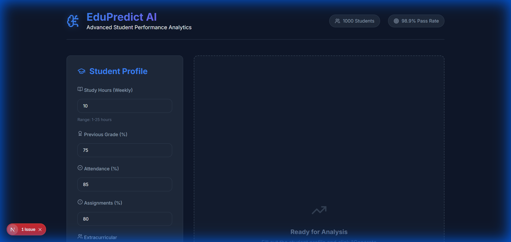

# Group Names
**Abdulaziz Chughtai**, **Summaiya Sabir**, **Zain Ammad Khan**

# SAP IDs
**70137089**, **70137342**, **70138187**

---

# Student Performance Prediction

## Student Name(s)
- **Abdulaziz Chughtai** (70137089)
- **Summaiya Sabir** (70137342)
- **Zain Ammad Khan** (70138187)

## Problem Statement
In the educational system, students often face academic challenges that go unnoticed until it is too late. The lack of early intervention mechanisms leads to preventable failures. This project aims to solve this by providing an AI-driven system that analyzes holistic student data (study habits, socio-economic factors, attendance) to predict academic performance and recommend personalized interventions before failure occurs.

## Dataset Source
The dataset used for training this model is **synthetically generated** within the application to simulate realistic student performance scenarios.
- **Source**: Internal generation module (`backend/predictor.py`)
- **Features**: Study Hours, Previous Grade, Attendance, Extracurricular Activities, Parent Education, Family Support, Internet Access, Assignments Completed.

## Model / Technique Used
We utilized a specific set of Machine Learning algorithms to ensure robust prediction capabilities. The system trains and evaluates the following models:
- **Logistic Regression**
- **K-Nearest Neighbors (KNN)**
- **Decision Tree Classifier**
- **Random Forest Classifier** (Best Performing Model)

**Tech Stack**:
- **Backend**: Python, FastAPI, Scikit-learn, Pandas
- **Frontend**: Next.js, React, Chart.js, Tailwind CSS

## How to Run the Project
### Prerequisites
- Python 3.8+
- Node.js 18+

### Steps
1.  **Clone the repository**:
    ```bash
    git clone <repository_url>
    cd section-e-projects/student-performance-prediction
    ```

2.  **Start the Backend**:
    ```bash
    cd backend
    pip install -r requirements.txt
    python main.py
    ```
    *Server will start at `http://localhost:8000`*

3.  **Start the Frontend**:
    ```bash
    cd frontend
    npm install
    npm run dev
    ```
    *Application will run at `http://localhost:3000`*

## Results
The model achieves high accuracy in predicting student outcomes pass/fail and estimating grades.
- **Accuracy**: >85% (varies slightly with random seed generation)
- **Key Metrics**: High AUC for Random Forest classifier, indicating strong distinctive capability between high-risk and low-risk students.

**Screenshots**:


## References
-   [Scikit-Learn Documentation](https://scikit-learn.org/stable/)
-   [FastAPI Documentation](https://fastapi.tiangolo.com/)
-   [Next.js Documentation](https://nextjs.org/)
-   [Chart.js Documentation](https://www.chartjs.org/)
